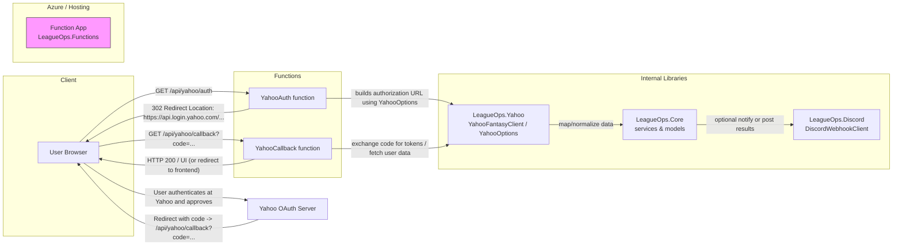
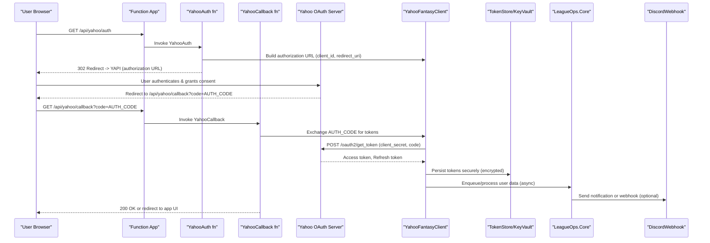

**LeagueOps Functions — Architecture & OAuth flow**

This document explains how the `LeagueOps.Functions` project handles Yahoo OAuth redirects and how it interacts with the other components in the repository.

Mermaid diagram (flow):

Notes
- `YahooAuth` constructs the OAuth authorization URL using `YahooOptions` (ClientId, RedirectUri) and returns a 302 redirect to Yahoo.
- `YahooCallback` parses the OAuth `code` query parameter, uses `YahooFantasyClient` to exchange the code for tokens and/or fetch data, then passes data into `LeagueOps.Core` services.
- `LeagueOps.Core` contains business logic (weekly league processing, models) and may trigger `LeagueOps.Discord` to post notifications.
- Locally the Functions host runs on `http://localhost:7071/api/...`. In Azure the Function App provides the public endpoints.
- Secrets/config (client id/secret, redirect URI) are provided via app settings / `local.settings.json` and bound via `IOptions<YahooOptions>`.

If you want I can add a second diagram showing sequence details (token exchange, storage, and webhooks), or generate a simple sequence diagram for the Yahoo OAuth exchange.

Sequence diagram — Yahoo OAuth exchange

Notes
- Store tokens in a secure store (Key Vault, encrypted database) — do not log raw tokens.
- Perform token exchange and sensitive operations server-side (Functions) — keep client secrets out of front-end code.
- Use background processing (queue/service) for heavy or long-running tasks after receiving tokens.
- Consider rotating credentials and using managed identities to access secret stores.
